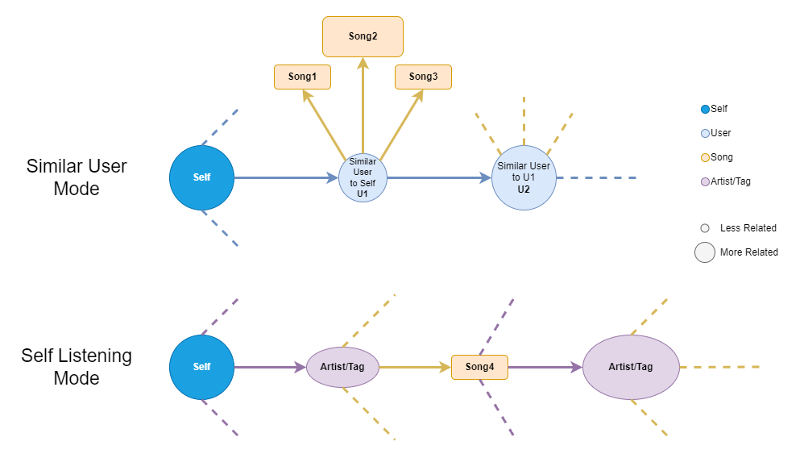

# Tree-Structure Two-Modes Music Recommendation
[Website demo](http://52.91.131.179)

Installation
============
Voyager requires Python >=3.9 and please use pip install -r requirements.txt to download all the required packages.

Python Install
--------------
git clone https://github.com/MineDojo/Voyager need to change

cd TreeMusicRecommendation

pip install -r requirements.txt

Fabric Mods Install
-------------------
You need to install fabric mods to support all the features in Voyager. Remember to use the correct Fabric version
of all the mods.

Follow the instructions in Fabric Mods Install to install the mods.

Getting Started
===============
Voyager uses OpenAI's GPT-4 as the language model. You need to have an OpenAI API key to use Voyager. You
can get one from here.

After the installation process, you can run Voyager by:
